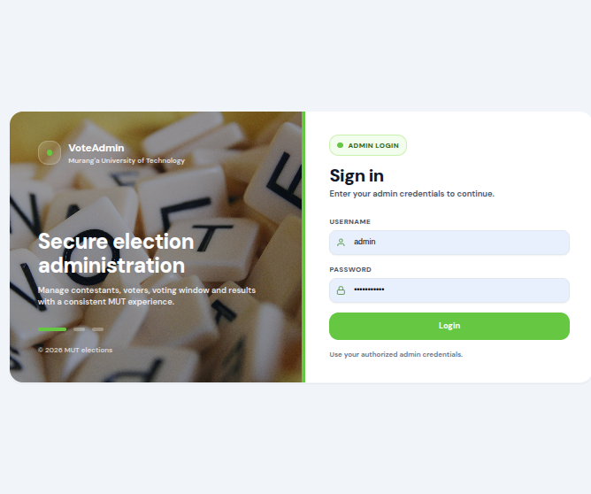
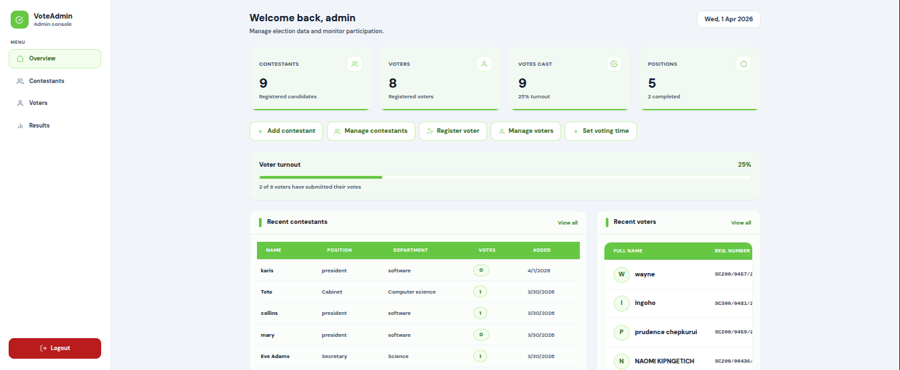
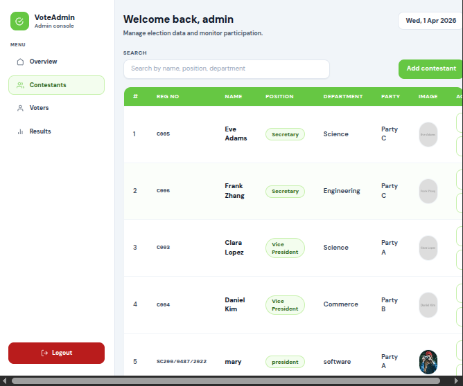
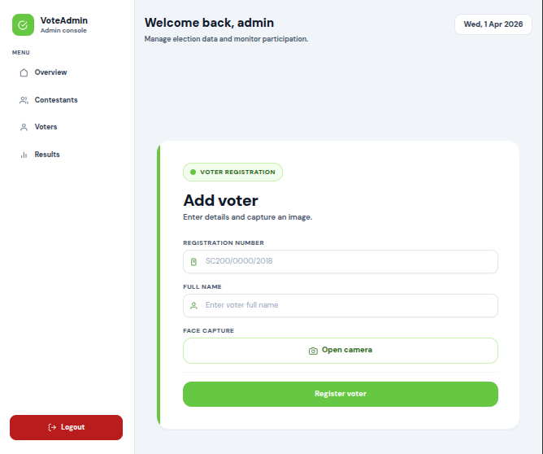
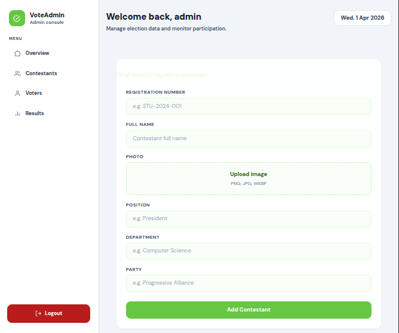

# Voting System

[](LICENSE)
[](../../actions)
[](../../releases)

A modern web application for running secure, transparent voting processes. Built with [add your stack, e.g. React, Node.js, Express, MongoDB].

---

## 🚀 Features

- **Secure Authentication:** Only eligible users can vote.
- **Admin Panel:** Manage voters, contests, positions, and results.
- **Real-time Results:** See results and analytics instantly.
- **Role-based Access:** Distinct user/admin flows.
- **Responsive UI:** Works great on mobile and desktop.

---

## 📸 Screenshots
### 🏁 Admin Login

 -->


### 🏁 Admin Dashboard

 -->


### 🏁 admin Dashboard Contestants Page

 -->


### 🏁 Admin add voter
 -->

### 🏁 Admin add contestant

 -->

### Voter Login Page 


### 🗳️ Voting Page


### 🚦 Results Page

 

---

## ✨ Getting Started

### Prerequisites

- **Node.js** (vXX+)
- **npm** or **yarn**

### Installation

```bash
git clone https://github.com/p-syntax/voting-system.git
cd voting-system
npm install
# or
yarn install
```

### Environment Variables

Copy `.env.example` to `.env` and fill in your environment-specific values:

```bash
cp .env.example .env
```

- `VITE_API_URL=` [Your API backend URL]
- Other variables as needed...

### Running the App

```bash
npm run dev   # For development (frontend, Vite)
# or
yarn dev
```

_Note: Ensure your backend server is running if the frontend connects to an API._

---

## 📝 Usage Guide

Describe how to login, vote, and check results here.

---

## 🛠️ Tech Stack

- **Frontend:** React, Tailwind CSS, Vite
- **Backend:** [e.g. Express, MongoDB] (if applicable)
- **Authentication:** JWT-based (custom/Auth0/etc)

---

## 👨‍💻 Project Structure

```
/
├── src/
│   ├── components/
│   ├── context/
│   ├── pages/
│   ├── api/
│   ├── ...
├── public/
│   └── ...
├── .env.example
├── package.json
└── ...
```

---

## 🏆 Contributing

Contributions are welcome!  
Please [open issues](../../issues) and [submit pull requests](../../pulls).

---

## 📄 License

This project is licensed under the MIT License - see the [LICENSE](LICENSE) file for details.

---

*Designed & built by [YourName/Team @p-syntax](https://github.com/p-syntax/)*
